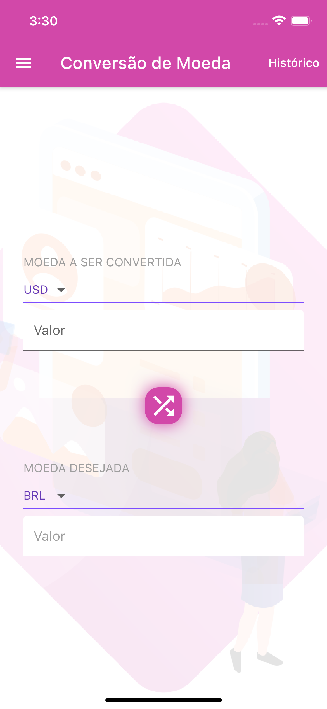
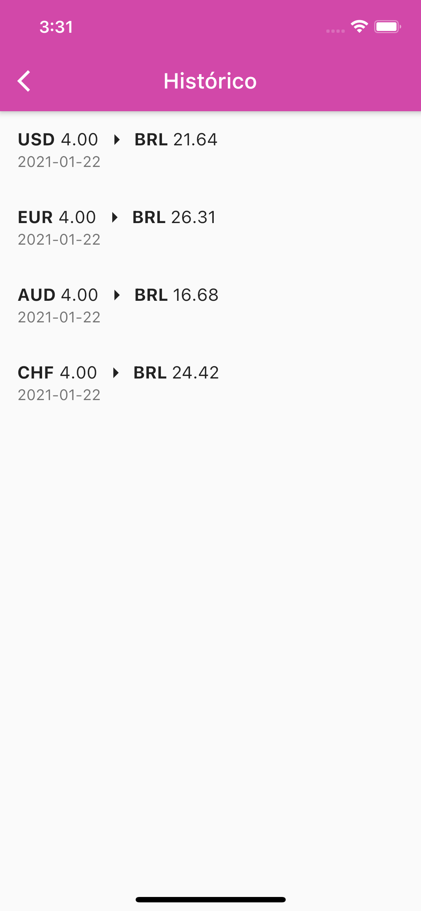

# IN8 Converter

Um aplicativo iOS/Android feito em Flutter para conversão de diferentes moedas.

Cada conversão terá o seu histórico salvo localmente.

## Repositório Público

- [Github](https://github.com/dmvvilela/in8-converter)

## Informações Gerais

O app não se conecta a um back-end. Portanto qualquer login social funcionará diretamente.
O login por e-mail irá validar antes se o e-mail é válido e a senha possui ao menos 6 caracteres.

## Screenshots

<!-- 

 -->

## Possíveis melhorias

- Mostrar o nome das moedas para facilitar.
- Separação de imagens em 2.0x, 3.0x
- Testes automatizados.
